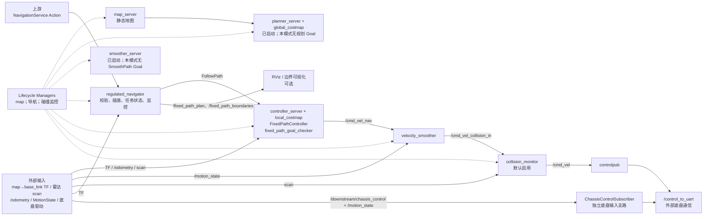
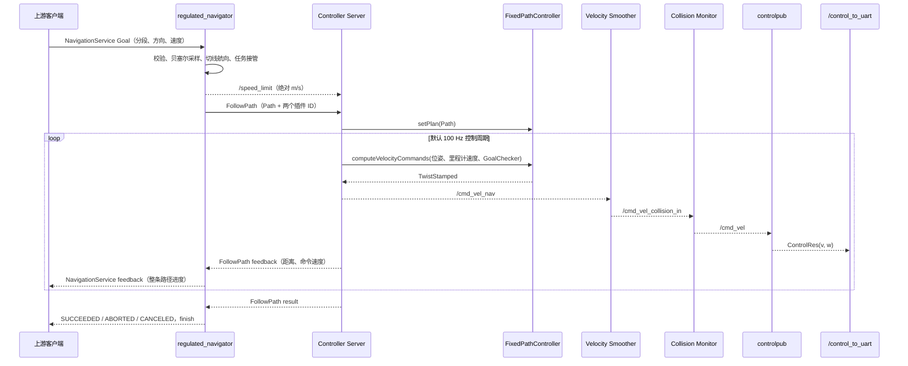
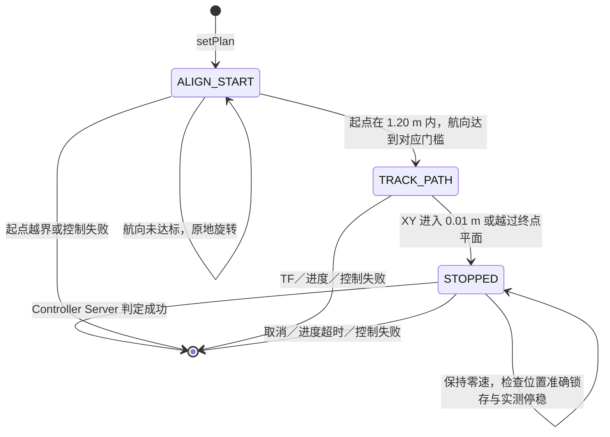
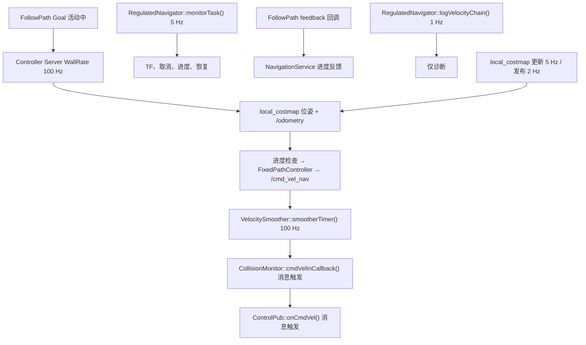

# `fixed_path` 固定路径模式架构与调用链

核对日期：2026-10-09，默认控制语义沿用 `e3154683`。控制器与速度平滑器默认 `100 Hz`；当前使用停车／位置锁存判定及原恢复流程，不包含已撤销的连续 1 秒精度窗口、3 秒终点超时或固定路径失败不重试改动。新一轮效率实验的停后 1 秒窗口由独立工具验收，未写入生产成功分支。

本文对应以下**默认**启动命令，以当前工作空间源码和 [启动文件](../launch/regulated_modules.launch.py)、[参数文件](../params/regulated_modules.yaml) 为准：

```bash
ros2 launch nav2_regulated_modules regulated_modules.launch.py operation_mode:=fixed_path
```

这里的“默认”包括 `use_composition:=False`、`use_collision_monitor:=true`、`use_rviz:=True`、`autostart:=true`、`adaptive_goal_braking_enabled:=false` 和 `use_sim_time:=false`。启动文件通过 `RewrittenYaml` 重写参数；显式传入启动参数或 `params_file` 后，应以实际节点参数为准。本文描述源码静态调用关系和默认配置，不代表本轮已启动机器人并测得实际频率、制动距离或停车精度。

## 1. 启动边界与模块

`operation_mode` 只在 Launch 阶段选择运行图，不支持运行中热切换。`fixed_path` 属于导航组：启动地图、导航生命周期节点、底盘出口和可选可视化；`myagv_keyboard_control` 只在 `remote` 模式启动。固定路径不使用 BT，也不把业务分段交给全局规划器。



| 模块 | 固定路径模式中的职责与边界 |
| --- | --- |
| `map_server` | 载入 `map` 指定的静态地图，由独立 Lifecycle Manager 激活；不生成业务路径。 |
| `planner_server`／`smoother_server` | 为统一生命周期列表而启动、激活；`regulated_navigator` 在固定路径任务中不发送 `ComputePath*`／`SmoothPath` Goal。Planner 的 `global_costmap` 仍可能运行更新。 |
| `regulated_navigator` | 暴露 `/navigation_service`、构造路径、选择控制器、管理抢占／取消／恢复、发布可视化和 `SpeedLimit`。`/goal_pose` 与自主导航 Action 在此模式被拒绝或忽略。 |
| `controller_server` | 承载 `FollowPath`、`FixedPathController`、`fixed_path_goal_checker`、进度检查器与 `local_costmap`，按控制周期输出速度。 |
| `velocity_smoother` | 订阅控制器输出、`SpeedLimit` 与 `/motion_state` 闭环反馈，按加减速度及速度边界发布平滑速度。 |
| `collision_monitor` | 默认订阅平滑速度和 `/c200_lidar_node/scan`，依据 Stop／Slowdown 区域对命令停车或缩放。关闭时平滑器直接输出 `/cmd_vel`。 |
| `controlpub` | 收到有效 `/cmd_vel` 时，将 `Twist.linear.x/angular.z` 映射到 `ControlRes.v/w`，发布 `/control_to_uart`；它不再做速度限幅。 |
| `ChassisControlSubscriber` | `regulated_navigator` 中并存的独立输入支路，处理 `/downstream/chassis_control` 与 `/motion_state`，也持有 `/control_to_uart` 发布器。其周期回调检测到该话题发布者多于一个时会停止本支路输出；部署前仍需核对实际发布者和底盘仲裁。 |
| 外部系统 | Launch **不启动**定位、雷达、`/odometry`、`/motion_state` 或底盘驱动；必须由现场系统提供。RViz 与碰撞边界显示不参与控制判定。 |

默认 `Lifecycle Manager` 分别管理 `map_server`、`planner_server → controller_server → smoother_server → velocity_smoother → regulated_navigator`，以及 `collision_monitor`。`controlpub` 和边界显示节点不在这些生命周期列表中。`use_composition:=true` 时 Nav2 组件装入指定容器，`regulated_navigator` 与 `controlpub` 仍以独立进程启动；业务调用链不变。

## 2. Action、路径生成与任务接管

业务入口是 [`NavigationService.action`](../../byd_custom_msgs/action/NavigationService.action)：Goal 为 `task_id` 与 `NaviSegment[] navi_segment`，Result 为 `finish`，Feedback 为 `cur_task_id`、`cur_seg_id`、`progress`。当前服务端将 `cur_seg_id` 置空，`progress` 表示整条路径比例，成功时置为 `1.0`。下游控制反馈到达时触发该 Action 的进度反馈；`feedback_frequency=5.0` 对应的 `publishFeedback()` 定时器主要发布普通导航 Action 反馈，不应解读为固定路径反馈固定 5 Hz。

| Goal 字段 | 当前处理 |
| --- | --- |
| `task_id` | 原样保存并回填 `cur_task_id`。 |
| `segment_type`、`node1`、`node2`、`control_pos1`、`control_pos2` | 决定直线／贝塞尔几何；四个点都要有有限坐标，直线控制点虽不参与形状计算也要通过有限值检查。`z` 会检查但输出路径设为 `0`。 |
| `motion_direction` | 每段必须为 `1` 或 `2`，且整条任务一致；决定 Path 中车头朝向与控制速度正负。 |
| `max_speed` | 每段必须为有限正数；整条任务取最小请求值，再受 `fixed_path_max_speed` 钳位。 |
| `segment_name`、`segment_id`、`max_load_speed`、`dwell_time` | 当前路径生成与控制链不使用；`cur_seg_id` 也未填入分段 ID。不能据此推断有分段停车或停留动作。 |

1. `handleNavigationServiceGoal()` 先检查模式、Lifecycle 活跃状态、分段非空；每段 `motion_direction` 只能为 `1` 前进或 `2` 后退，整条 Action 方向必须一致，`max_speed` 必须是有限正数。未通过时直接拒绝 Goal。
2. 接受后 `prepareFixedPath()` 再检查全部几何点为有限值、每段首尾不重合、相邻段端点在 `0.001 m` 内连续、段类型受支持。此阶段失败则 Goal 已接受但返回 `ABORTED/finish=false`。
3. `segment_type=1` 时把直线两端转换为共线的四个三次贝塞尔控制点；`segment_type=2` 时直接使用 `node1 → control_pos1 → control_pos2 → node2`。每段先密集估算弧长，再按 `fixed_path_step=0.1 m` 近似等距采样，保留终点；拼接时移除上一段末点。追加采样时，相邻点距离不超过 `1e-9 m` 则用新点替换上一点，保留精确业务终点，避免浮点尾点产生无效切线。用于计算航向的切线向量长度不超过 `1e-9 m` 时，路径仍会被拒绝。
4. 每个 Pose 都写入 `global_frame=map`，`z=0`；用相邻采样点求路径切线。前进时 Pose 航向沿切线，后退时加 `π`，编码**车辆朝向**和运动方向。插值只处理几何密度，不检查业务路径的可行性和全程避障。
5. `handleNavigationServiceAccepted()` 等待 `FollowPath` 服务可用，先结束旧任务，再保存路径、总长度、方向、起终点航向和任务代次。当前车体位置不会被重置到 `node1`。`publishFixedPath()` 发布中心线及左右 `0.40 m` 的显示边界。
6. 多段请求速度取最小值，再执行 $v_{\mathrm{effective}}=\min(\min_i v_{\mathrm{segment},i},v_{\mathrm{fixed\_path\_max}})$；默认全局上限为 `1.5 m/s`。`publishSpeedLimit()` 以 `percentage=false` 发布绝对速度值，Controller Server 和 Velocity Smoother 都订阅该话题。
7. `sendFollowPath()` 直接向 Controller Server 下发完整 `Path`，指定 `controller_id=FixedPathController` 与 `goal_checker_id=fixed_path_goal_checker`；不进入 Planner／路径 Smoother。任务代次和 `follow_sequence` 过滤已过期的异步回调。



上图每次控制反馈与速度发布是调用关系示意，不保证每个中间节点的回调同一时刻执行。`/speed_limit` 与 `FollowPath` 的先后消息到达也受 ROS 调度影响：服务端在下发前发布一次限速，并在下游 Goal 接受回调中再次发布。

## 3. 控制周期、起点、跟踪与终点

`Controller Server` 在 `FollowPath` 活跃时先等待 `local_costmap.isCurrent()`，然后每轮更新路径、通过进度检查器检查位移、取得机器人位姿与 `/odometry` 速度，调用 [`FixedPathController::computeVelocityCommands()`](../src/fixed_path_controller.cpp)，发布命令与反馈，再检查是否到点。`controller_frequency=100.0` 对应名义周期 `0.01 s`；等待 Costmap 更新的内部轮询也为 `100 Hz`，但两者是不同执行环节，均不能代替实际输出频率测量。插件的 `setPlan()` 要求至少两个点、有效坐标系及起终点切线；首点 Pose 朝向和起点切线夹角的余弦须能明确区分前进／后退。每条新路径会重置最近点、起点策略、制动与停车锁存。控制器每轮将当前位姿转换到路径坐标系后计算误差，不在任务开始时冻结该变换。



### 3.1 起点

- 起点到车辆的平面距离须不超过 `start_position_tolerance=1.20 m`，否则插件抛错。前进以车头朝向、后退以车头朝向加 `π`，同路径切线比较。
- 首次横向误差不超过 `0.20 m` 时锁定“直接跟踪”策略：运动方向航向误差不超过 `15°` 就在**本控制周期**进入跟踪；否则先原地转到该门槛。
- 首次横向误差超过 `0.20 m` 时锁定“严格对齐”策略：先原地转到 `±3°`；`alignment_stable_cycles=1`，因此默认在达标的同一控制周期开始跟踪，不要求先停稳。
- 所有新路径均进入起步保护，不受初始误差大小影响。纵向指令上限为任务限速与 `start_offset_speed_limit=0.30 m/s` 的较小值；从开始平移跟踪时的路径投影位置沿路径前进至少 `start_speed_limit_distance=0.50 m`，且越过路径首点的 `0.50 m` 范围后，才允许解除。旋转和横向恢复不累计保护距离，短路径可能全程限速。
- 距离满足后，最近有效路径段横向误差≤`0.20 m`、运动方向航向误差≤`20°`连续`10`周期，才单向解除；误差超限或投影失效清零计数。100 Hz下名义稳定时间约`0.1 s`。新路径重置保护；解除后沿用S曲线加速。
- 收到路径时实测线速度高于起步上限，先输出零目标由平滑器减速，尚不累计保护距离。物理速度不能瞬时降至限速；控制器指令限速与底盘实测速度须分别验证。

### 3.2 跟踪与速度

插件从上次最近点开始向前搜索，不让定位抖动使路径索引回退；沿离散点累计弧长，取第一个满足前视距离的点，不对中间路径段再次插值。末段不足前视距离时沿终点切线延长前视点。前视点转换到车体坐标系后，按 Pure Pursuit 曲率 $\kappa=2y/L^2$ 计算角速度。常规前视由 `lookahead_dist=0.45 m` 与实测速度乘 `lookahead_time=1.5 s` 取较大值，再限制在 `0.25–0.75 m`；临近终点时缩短前视。纵向命令先受 `desired_linear_vel=1.5 m/s`、Action `SpeedLimit`、起步限速和曲率角速度上限共同约束，最后按前进／后退写入正／负号。角速度按 $v\kappa$ 计算，并限制在 `±0.4 rad/s`。

默认 `adaptive_goal_braking_enabled=false`：按运动方向上的实测线速度与 `goal_linear_deceleration=0.25 m/s²` 算停车距离，加入 `0.1 s` 反应时间和 `0.1 m` 距离裕量，在减速区用 $v^2=2ad$ 限制目标速度；未进入位置容差时，制动目标速度以 `0.01 m/s` 作为微量接近下限，同时仍受有效速度上限约束。制动阶段目标速度只下降，不因剩余距离波动重新加速。终点动态前视按 $d=\operatorname{clamp}(0.20+0.10(v-0.75),0.15,0.25)\,\mathrm{m}$ 计算。

可选 `adaptive_goal_braking_enabled=true` 会切换到实测速率包络与 jerk 限制，并将 Velocity Smoother 的 `max_decel` 改为 `[-1.0, 0.0, -3.2]`、`immediate_stop_on_zero_command` 改为 `true`。该分支由启动参数显式启用；不能把它的行为写成默认行为。

### 3.3 停车与完成

进入 `fixed_path_goal_checker.xy_goal_tolerance=0.01 m` 或到达末段且越过终点切线的法向平面时，控制器进入 `STOPPED` 并锁存零速，不再追点或原地转向。终点切线航向误差会记录到日志，但**不参与成功条件**。越界锁存也不自动等于位置准确：控制器分别维护停车锁存和位置精度状态。

默认非自适应分支在首次停车时记录 `terminal_position_accurate_`。停车后若原先不准确、后续位姿进入容差，会把该标志单向置为准确；已准确后不会因当前位姿又离开容差而撤回。因此该标志是位置准确锁存，不是停后持续误差检验。

显式设置 `FixedPathController.goal_stop_entry_tolerance>0` 时，采用更小的停车入口半径，并按 GoalChecker 的验收半径逐周期复核当前精度；入口半径不得超过验收半径。实验采用入口 `0.005 m`、验收 `0.01 m`，越过终点平面仍锁存零速。该参数默认 `0.0`，保留上述原逻辑；它不在生产成功分支增加连续 1 秒窗口，该窗口由独立实验工具验证。

当前 [`ControllerServer::isGoalReached()`](../../nav2_controller/src/controller_server.cpp) 对 `TerminalAwareController` 走专用分支：要求已停车锁存、位置准确标志为真，以及 `/odometry` 的阈值处理后平面线速度幅值不超过 `0.01 m/s`、角速度绝对值不超过 `0.05 rad/s`。虽然 [`FixedPathGoalChecker`](../src/fixed_path_goal_checker.cpp) 配有 `position_stable_cycles=10` 并实现 `isGoalReached()`，当前专用成功分支只读取它的停稳容差，不调用该稳定计数方法。不能把 10 周期写成实际终点完成门槛，更不能解释成连续 1 秒精度验收。通过后 `FollowPath` 成功，外层 Action 返回 `finish=true`；航向误差仍只作诊断。

如果越过终点平面后位置准确标志仍为假，插件保持零速，Controller Server 拒绝成功；默认没有独立的 3 秒终点超时，也不会自动反向补偿。后续由取消、原进度超时或控制异常决定是否结束并进入恢复。自适应分支不同：停车后逐周期复核当前 XY，实测线速度绝对值已降至停止阈值但 XY 仍在容差外时抛出控制异常；该异常检查没有同时要求角速度达标，该分支默认关闭。

## 4. 速度、传感器和周期函数



| 触发方式／默认频率 | 入口与调用 | 作用 |
| --- | --- | --- |
| 控制循环，`100 Hz` | `ControllerServer::computeControl() → computeAndPublishVelocity() → FixedPathController::computeVelocityCommands()` | 读取局部代价地图位姿和 `/odometry`，运行进度检查、控制、反馈与 `/cmd_vel_nav` 发布；目标完成也在控制循环检查。 |
| 平滑定时器，`100 Hz` | `VelocitySmoother::smootherTimer()` | 用 `/motion_state` 闭环反馈及限速、加减速参数处理最近命令；默认 `velocity_timeout=1.0 s`。 |
| 导航监控定时器，`5 Hz` | `RegulatedNavigator::monitorTask()`，周期 `200 ms` | 处理取消、`map→base_link` TF 丢失、位姿突跳开关、任务无进展与恢复；仅自主导航分支会定期重规划。 |
| 普通导航反馈定时器，`5 Hz` | `RegulatedNavigator::publishFeedback()` | 向普通 `NavigateToPose`／`NavigateThroughPoses` 发布反馈；固定路径进度由 `FollowPath` feedback 回调触发。 |
| 诊断定时器，`1 Hz` | `RegulatedNavigator::logVelocityChain()` | 汇总里程计、控制器输出和平滑器输出；不参与控制。 |
| 底盘输入支路，`100 Hz` | `ChassisControlSubscriber::processControlCommand()` | **仅收到该支路指令并保持其状态时**计算 S 曲线输出；检查指令／`MotionState` 超时和发布者冲突。 |
| 局部代价地图，更新 `5 Hz`／发布 `2 Hz` | `controller_server.local_costmap` | 激光 `voxel_layer` 与 `inflation_layer`，为控制服务器提供位姿与地图状态。 |
| 全局代价地图，更新／发布 `1 Hz` | `planner_server.global_costmap` | 随 Planner Server 启动，但本模式不请求全局规划。 |
| 消息触发，无固定输出频率 | `CollisionMonitor::cmdVelInCallback() → process()`；`ControlPub::onCmdVel()` | 前者依据最新扫描点和区域处理每条输入速度，后者转发有效速度；频率受上游消息和执行调度影响。 |

`Controller Server` 使用 `/odometry`，Velocity Smoother 使用 `/motion_state`；两者是不同参数入口。`regulated_navigator` 另订阅 `/odometry` 做速度链诊断，并用 TF 查询 `map→base_link` 监测任务进度。局部代价地图由控制服务器启动，不能因业务路径不经全局规划就认为控制链不需要 TF、雷达或 Costmap。

Collision Monitor 依据 `base_link` 周围的矩形区域处理激光点：Stop L3 的前／后／侧留白为 `1.2/0.8/0.4 m`；Slowdown L2 为 `2.5/1.5/0.6 m`、速度比 `0.6`；Slowdown L1 为 `4.0/2.5/0.8 m`、速度比 `0.8`。配置的扫描源超时为 `0.5 s`。它是速度链上的独立安全层，不会替上游重新规划固定路径；区域、点数门槛和传感器有效性仍应以现场参数及观测为准。

`/speed_limit` 的绝对值同时进入控制器插件和速度平滑器。速度平滑器默认线速度范围 `[-1.5, 1.5] m/s`、线加／减速度 `+2.5/-2.5 m/s²`，角速度范围 `[-2.0, 2.0] rad/s`，`CLOSED_LOOP` 反馈来自 `/motion_state`。`use_collision_monitor:=false` 时 Launch 把平滑器输出直接改映射至 `/cmd_vel`；默认开启时由碰撞监控发布最终 `/cmd_vel`。`controlpub` 只做消息字段映射，底盘驱动可能另有限速，须以现场实现核对。

### 4.1 闭环平滑与全零停车

当前 [`VelocitySmoother::feedbackReference()`](../../nav2_velocity_smoother/src/velocity_smoother.cpp) 以内部上一条速度斜坡为基准，按 $w=\operatorname{clamp}(1/(fT),0,1)$ 校正实测速度，再进行速度／加减速度约束；默认 `f=100 Hz`、`feedback_correction_time=T=0.1 s`，校正权重为 `0.1`。最终闭环输出还受相对上一内部命令的连续增量限制；内部命令在死区过滤前保存。该保留的升频修复避免每周期直接从有跟踪偏差的实测速度重启斜坡；它不等于切换 OPEN_LOOP，也不证明实车动态响应完全相同。

直接启动本包、默认非自适应配置时，`immediate_stop_on_zero_command=false`，全零输入仍经过速度平滑减速；不能把控制器零速锁存等同于最终底盘指令在同一周期立即归零。显式启用自适应固定路径时，Launch 才将该项覆盖为 `true`，并覆盖正常线减速度为 `-1.0 m/s²`。停车后实际残余位移／转动仍取决于速度链与底盘。

### 4.2 直接入口与本地仿真的反馈差异

| 项目 | 本文的默认直接规控入口 | `myworld_bringup` 默认非组合固定路径仿真入口 |
| --- | --- | --- |
| Controller Server 速度反馈 | `/odometry`，`nav_msgs/Odometry` | `/odom`，`nav_msgs/Odometry` |
| Velocity Smoother 闭环反馈 | `/motion_state`，`byd_custom_msgs/MotionState` | `/odom`，`nav_msgs/Odometry` |
| `/motion_state` 发布源 | 外部底盘反馈 | `odom_to_motion_state.py` 从 `/odom` 逐条转换，底盘输入支路使用 |
| 控制器／平滑器周期 | 默认 100 Hz | 默认 100 Hz |
| 里程计发布频率 | 外部驱动负责，需实测 | Gazebo OdometryPublisher 配置 100 Hz |
| 全零立即停车 | 默认非自适应为 false | 仿真导航包装入口在 fixed_path 下重写为 true |
| 定位与传感器 | 外部提供 TF／雷达 | Gazebo 提供机器人、里程计、雷达；AMCL 提供 map 定位 |

[`OdomSmoother`](../../nav2_util/src/odometry_utils.cpp) 按反馈话题末级名称选择消息类型：`motion_state` 使用 `MotionState.v_car/w_car`，其他名称使用 `Odometry.twist.twist`。仿真包装入口的 [`navigation_launch.py`](../../myworld_bringup/launch/navigation_launch.py) 会再次重写参数；组合组件还会叠加 `fixed_path_smoother_params`，因此显式切换组合模式后需核对最终节点参数。仅查看原 YAML 中的 `immediate_stop_on_zero_command` 不能得出最终设置。

## 5. 取消、异常和恢复

- 新 Goal 通过路径生成及下游服务检查后，`preemptCurrentTask()` 取消旧 `FollowPath`、向 `/cmd_vel_nav` 连发三帧零速并终止旧外层 Goal；新任务以新的代次继续。旧回调被代次和序号过滤。客户端取消由 `monitorTask()` 收口为 `CANCELED/finish=false`；下游失败或路径准备失败返回 `ABORTED/finish=false`。
- `monitorTask()` 每 `200 ms` 查询 TF。`localization_timeout=0.3 s` 内持续无有效 TF 后取消跟踪、发零速并进入 `LOCALIZATION_LOST`；恢复需连续稳定 `0.5 s`，超过 `10 s` 则失败。`enable_localization_jump_detection=false` 是默认值；显式启用后，超过平移／旋转阈值会取消旧跟踪并恢复。
- 控制期间，导航器用 `map` 位姿至少移动 `progress_min_translation=0.1 m` 才刷新自己的进度时间；Launch 将其固定路径 `progress_timeout` 和 Controller Server `progress_checker.movement_time_allowance` 都覆盖为 `fixed_path_progress_timeout=120 s`。Controller Server 的进度检查器另有 `required_movement_radius=0.5 m`，两套判定不能混为一谈。
- `startRecovery()` 取消下游 Goal、发零速，按服务可用性请求清理局部／全局代价地图，等待 `0.8 s` 后继续；默认最多 `2` 轮。`resumeCurrentTask()` 对固定路径重新发布已保存 Path 并重发 `FollowPath`，不改走自主规划。当前固定路径的下游非成功结果，在外层任务并非取消状态时仍调用 `startRecovery()`，不采用试验中的“FollowPath 失败直接结束且不重试”。控制插件抛出的 `PlannerException` 可由 Controller Server 的 `failure_tolerance=0.3 s` 先容忍短时失败，持续失败再使 `FollowPath` 失败并进入导航器恢复。
- 完成、取消或失败时 `resetTask()` 发布 `SpeedLimit=0` 并清理任务状态。零速命令经过速度链后的实际停稳取决于平滑器、碰撞监控和底盘反馈；文档中的控制周期是配置目标频率，不能代替实车测量。

## 6. 源码索引与核对入口

| 问题 | 当前依据 |
| --- | --- |
| 哪些节点启动、哪些参数被覆盖、速度如何重映射？ | [`regulated_modules.launch.py`](../launch/regulated_modules.launch.py)、[`regulated_modules.yaml`](../params/regulated_modules.yaml) |
| Action 接受、插值、方向与速度限制在哪里？ | [`navigator_fixed_path.cpp`](../src/navigator_fixed_path.cpp)、[`NavigationService.action`](../../byd_custom_msgs/action/NavigationService.action)、[`NaviSegment.msg`](../../byd_custom_msgs/msg/NaviSegment.msg) |
| 跟踪、起点策略、制动和到点在哪一层？ | [`fixed_path_controller.cpp`](../src/fixed_path_controller.cpp)、[`fixed_path_goal_checker.cpp`](../src/fixed_path_goal_checker.cpp)、[`controller_server.cpp`](../../nav2_controller/src/controller_server.cpp) |
| 监控、恢复、反馈和最终速度出口在哪里？ | [`navigator_monitor.cpp`](../src/navigator_monitor.cpp)、[`navigator_control.cpp`](../src/navigator_control.cpp)、[`chassis_control_subscriber.cpp`](../src/chassis_control_subscriber.cpp)、[`controlpub_node.cpp`](../../controlpub/src/controlpub_node.cpp) |

现场核对建议从 `ros2 lifecycle get /regulated_navigator`、`ros2 action info /navigation_service`、`ros2 param get /controller_server controller_frequency`、`ros2 param get /velocity_smoother smoothing_frequency`、`ros2 topic info -v /control_to_uart`、TF、`/odometry`、`/motion_state` 和雷达扫描入手。这些命令只用于后续运行态取证；本文没有把静态源码结论当作现场验证结果。

## 按实测速度连续调整制动裕量（实验，默认关闭）

`dynamic_goal_braking_margin_enabled` 仅作用于 `adaptive_goal_braking_enabled=false` 的固定路径制动分支。裕量为 `m_min + (m_high-m_min) * clamp(abs(v_measured)/v_transition, 0, 1)`；高速上界沿用 `goal_braking_distance_margin=0.1 m`，候选低速下界 `goal_braking_min_distance_margin=0.03 m`，过渡速度 `goal_braking_margin_transition_speed=0.3 m/s`。前进／倒车共用速度绝对值，保持原方向处理、反应时间、减速度、0.01 m/s接近速度和终点停车锁存。速度指令仍受上一周期制动指令上界约束，裕量缩小不会重新加速。

新增启动参数 `fixed_path_dynamic_goal_braking_margin_enabled`、`fixed_path_goal_braking_min_distance_margin`、`fixed_path_goal_braking_margin_transition_speed`，并修复 `fixed_path_goal_braking_distance_margin` 从入口到控制器的覆盖路由。四个参数默认空值表示读取参数YAML，显式参数优先；启用已有adaptive分支时不叠加连续裕量。无效新参数在控制器配置阶段拒绝，非有限反馈速度的裕量计算回退高速上界。

当前实车与仿真YAML均保持开关false；0.8 m/s同种子基线／候选A/B及后续全速度验收全部通过前不修改默认启用状态。

2026-10-10 A/B结果：基线、0.03 m、0.05 m每组20次有效测量；精度分别16/20、16/20、15/20。0.03 m终段约4.54／4.71 s（原10.48／10.34 s），蠕动约2.07／2.28 s。效率改善不替代精度验收，两个候选均未通过，开关保持false；未执行130次全速度与默认随机复核。

## 速度链文件与终端日志

主 launch 默认额外启动独立 `velocity_diagnostics_node`，文件 DEBUG 快照 100 Hz、终端 INFO 摘要 1 Hz，摘要也写入文件。记录控制器／平滑器／可选碰撞监控输入输出、ChassisControl 支路请求、底盘实际反馈及 UART 出口；每阶段附接收计数、数据年龄和有效状态，不参与控制。默认文件 `/tmp/nav2_logs/nav2_regulated_modules/velocity_diagnostics.log`；每文件 10 MiB、5 个备份，周期刷新。主 launch 子进程终端输出另由 ROS launch 留存。参数、字段及采样边界见 [velocity_logging.md](velocity_logging.md)。

## S 曲线普通起停

规控／仿真速度平滑器现默认开启 jerk_limited_smoothing，基于上一条实际输出维护加速度状态，以单调时钟 dt 限制加速度变化并提前收回加速度。普通零指令及输入超时不再走立即归零旁路，下游碰撞急停保持。硬加减速度值未提高，双工况取更严格的幅值与 jerk；误差1 Hz、速度与曲线状态100 Hz保存。新模式短时约束及一次0.3停车验证通过，未进行全速度或实车验收；详见速度日志说明。
