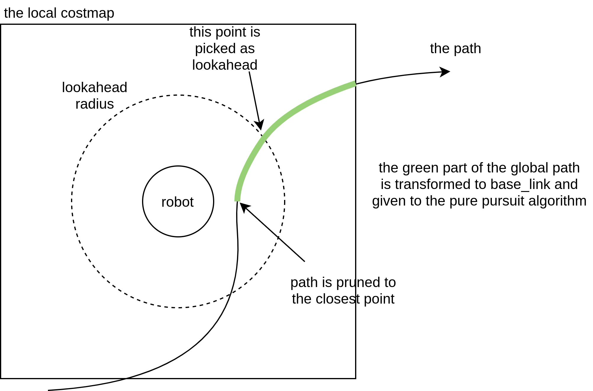

# Nav2 Regulated Pure Pursuit Controller

This is a controller (local trajectory planner) that implements a variant on the pure pursuit algorithm to track a path. This variant we call the Regulated Pure Pursuit Algorithm, due to its additional regulation terms on collision and linear speed. It also implements the basics behind the Adaptive Pure Pursuit algorithm to vary lookahead distances by current speed. It was developed by [Shrijit Singh](https://www.linkedin.com/in/shrijitsingh99/) and [Steve Macenski](https://www.linkedin.com/in/steve-macenski-41a985101/) while at [Samsung Research](https://www.sra.samsung.com/) as part of the Nav2 working group.

Code based on a simplified version of this controller is referenced in the [Writing a New Nav2 Controller](https://navigation.ros.org/plugin_tutorials/docs/writing_new_nav2controller_plugin.html) tutorial.

This plugin implements the `nav2_core::Controller` interface allowing it to be used across the navigation stack as a local trajectory planner in the controller server's action server (`controller_server`).

It builds on top of the ordinary pure pursuit algorithm in a number of ways. It also implements all the common variants of the pure pursuit algorithm such as adaptive pure pursuit. This controller is suitable for use on all types of robots, including differential, legged, and ackermann steering vehicles. It may also be used on omni-directional platforms, but won't be able to fully leverage the lateral movements of the base (you may consider DWB instead).

This controller has been measured to run at well over 1 kHz on a modern intel processor.

<p align="center">
  
</p>

See its [Configuration Guide Page](https://navigation.ros.org/configuration/packages/configuring-regulated-pp.html) for additional parameter descriptions.

## Pure Pursuit Basics

The Pure Pursuit algorithm has been in use for over 30 years. You can read more about the details of the pure pursuit controller in its [introduction paper](http://www.enseignement.polytechnique.fr/profs/informatique/Eric.Goubault/MRIS/coulter_r_craig_1992_1.pdf). The core idea is to find a point on the path in front of the robot and find the linear and angular velocity to help drive towards it. Once it moves forward, a new point is selected, and the process repeats until the end of the path. The distance used to find the point to drive towards is the `lookahead` distance.

In order to simply book-keeping, the global path is continuously pruned to the closest point to the robot (see the figure below) so that we only have to process useful path points. Then, the section of the path within the local costmap bounds is transformed to the robot frame and a lookahead point is determined using a predefined distance.

Finally, the lookahead point will be given to the pure pursuit algorithm which finds the curvature of the path required to drive the robot to the lookahead point. This curvature is then applied to the velocity commands to allow the robot to drive.

Note that a pure pursuit controller is that, it "purely" pursues the path without interest or concern about dynamic obstacles. Therefore, this controller should only be used when paired with a path planner that can generate a path the robot can follow. For a circular (or can be treated as circular) robot, this can really be any planner since you can leverage the particle / inflation relationship in planning. For a "large" robot for the environment or general non-circular robots, this must be something kinematically feasible, like the Smac Planner, such that the path is followable.



## Regulated Pure Pursuit Features

We have created a new variation on the pure pursuit algorithm that we dubb the Regulated Pure Pursuit algorithm. We combine the features of the Adaptive Pure Pursuit algorithm with rules around linear velocity with a focus on consumer, industrial, and service robot's needs. We also implement several common-sense safety mechanisms like collision detection.

The Regulated Pure Pursuit controller implements active collision detection. We use a parameter to set the maximum allowable time before a potential collision on the current velocity command. Using the current linear and angular velocity, we project forward in time that duration and check for collisions. Intuitively, you may think that collision checking between the robot and the lookahead point seems logical. However, if you're maneuvering in tight spaces, it makes alot of sense to only search forward a given amount of time to give the system a little leeway to get itself out. In confined spaces especially, we want to make sure that we're collision checking a reasonable amount of space for the current action being taken (e.g. if moving at 0.1 m/s, it makes no sense to look 10 meters ahead to the carrot, or 100 seconds into the future). This helps look further at higher speeds / angular rotations and closer with fine, slow motions in constrained environments so it doesn't over report collisions from valid motions near obstacles. If you set the maximum allowable to a large number, it will collision check all the way, but not exceeding, the lookahead point. We visualize the collision checking arc on the `lookahead_arc` topic.

The regulated pure pursuit algorithm also makes use of the common variations on the pure pursuit algorithm. We implement the adaptive pure pursuit's main contribution of having velocity-scaled lookahead point distances. This helps make the controller more stable over a larger range of potential linear velocities. There are parameters for setting the lookahead gain (or lookahead time) and thresholded values for minimum and maximum.

The final minor improvement we make is slowing on approach to the goal. Knowing that the optimal lookahead distance is `X`, we can take the difference in `X` and the actual distance of the lookahead point found to find the lookahead point error. During operations, the variation in this error should be exceptionally small and won't be triggered. However, at the end of the path, there are no more points at a lookahead distance away from the robot, so it uses the last point on the path. So as the robot approaches a target, its error will grow and the robot's velocity will be reduced proportional to this error until a minimum threshold. This is also tracked by the kinematic speed limits to ensure drivability.

The major improvements that this work implements is the regulations on the linear velocity based on some cost functions.  They were selected to remove long-standing bad behavior within the pure pursuit algorithm. Normal Pure Pursuit has an issue with overshoot and poor handling in particularly high curvature (or extremely rapidly changing curvature) environments. It is commonly known that this will cause the robot to overshoot from the path and potentially collide with the environment. These cost functions in the Regulated Pure Pursuit algorithm were also chosen based on common requirements and needs of mobile robots uses in service, commercial, and industrial use-cases; scaling by curvature creates intuitive behavior of slowing the robot when making sharp turns and slowing when its near a potential collision so that small variations don't clip obstacles. This is also really useful when working in partially observable environments (like turning in and out of aisles / hallways often) so that you slow before a sharp turn into an unknown dynamic environment to be more conservative in case something is in the way immediately requiring a stop.

The cost functions penalize the robot's speed based on its proximity to obstacles and the curvature of the path. This is helpful to slow the robot when moving close to things in narrow spaces and scaling down the linear velocity by curvature helps to stabilize the controller over a larger range of lookahead point distances. This also has the added benefit of removing the sensitive tuning of the lookahead point / range, as the robot will track paths far better. Tuning is still required, but it is substantially easier to get reasonable behavior with minor adjustments.

An unintended tertiary benefit of scaling the linear velocities by curvature is that a robot will natively rotate to rough path heading when using holonomic planners that don't start aligned with the robot pose orientation. As the curvature will be very high, the linear velocity drops and the angular velocity takes over to rotate to heading. While not perfect, it does dramatically reduce the need to rotate to a close path heading before following and opens up a broader range of planning techniques. Pure Pursuit controllers otherwise would be completely unable to recover from this in even modestly confined spaces.

Mixing the proximity and curvature regulated linear velocities with the time-scaled collision checker, we see a near-perfect combination allowing the regulated pure pursuit algorithm to handle high starting deviations from the path and navigate collision-free in tight spaces without overshoot.

Note: The maximum allowed time to collision is thresholded by the lookahead point, starting in Humble. This is such that collision checking isn't significantly overshooting the path, which can cause issues in constrained environments. For example, if there were a straight-line path going towards a wall that then turned left, if this parameter was set to high, then it would detect a collision past the point of actual robot intended motion. Thusly, if a robot is moving fast, selecting further out lookahead points is not only a matter of behavioral stability for Pure Pursuit, but also gives a robot further predictive collision detection capabilities. The max allowable time parameter is still in place for slow commands, as described in detail above.

## Configuration

| Parameter | Description |
|-----|----|
| `desired_linear_vel` | The desired maximum linear velocity to use. |
| `lookahead_dist` | The lookahead distance to use to find the lookahead point |
| `min_lookahead_dist` | The minimum lookahead distance threshold when using velocity scaled lookahead distances |
| `max_lookahead_dist` | The maximum lookahead distance threshold when using velocity scaled lookahead distances |
| `lookahead_time` | The time to project the velocity by to find the velocity scaled lookahead distance. Also known as the lookahead gain. |
| `rotate_to_heading_angular_vel` | If rotate to heading is used, this is the angular velocity to use. |
| `transform_tolerance` | The TF transform tolerance |
| `use_velocity_scaled_lookahead_dist` | Whether to use the velocity scaled lookahead distances or constant `lookahead_distance` |
| `min_approach_linear_velocity` | The minimum velocity threshold to apply when approaching the goal |
| `approach_velocity_scaling_dist` | Integrated distance from end of transformed path at which to start applying velocity scaling. This defaults to the forward extent of the costmap minus one costmap cell length. |
| `use_collision_detection` | Whether to enable collision detection. |
| `max_allowed_time_to_collision_up_to_carrot` | The time to project a velocity command to check for collisions when `use_collision_detection` is `true`. It is limited to maximum distance of lookahead distance selected. |
| `use_regulated_linear_velocity_scaling` | Whether to use the regulated features for curvature |
| `use_cost_regulated_linear_velocity_scaling` | Whether to use the regulated features for proximity to obstacles |
| `cost_scaling_dist` | The minimum distance from an obstacle to trigger the scaling of linear velocity, if `use_cost_regulated_linear_velocity_scaling` is enabled. The value set should be smaller or equal to the `inflation_radius` set in the inflation layer of costmap, since inflation is used to compute the distance from obstacles |
| `cost_scaling_gain` | A multiplier gain, which should be <= 1.0, used to further scale the speed when an obstacle is within `cost_scaling_dist`. Lower value reduces speed more quickly. |
| `inflation_cost_scaling_factor` | The value of `cost_scaling_factor` set for the inflation layer in the local costmap. The value should be exactly the same for accurately computing distance from obstacles using the inflated cell values |
| `regulated_linear_scaling_min_radius` | The turning radius for which the regulation features are triggered. Remember, sharper turns have smaller radii |
| `regulated_linear_scaling_min_speed` | The minimum speed for which the regulated features can send, to ensure process is still achievable even in high cost spaces with high curvature. |
| `use_rotate_to_heading` | Whether to enable rotating to rough heading and goal orientation when using holonomic planners. Recommended on for all robot types except ackermann, which cannot rotate in place. |
| `rotate_to_heading_min_angle` | The difference in the path orientation and the starting robot orientation to trigger a rotate in place, if `use_rotate_to_heading` is enabled. |
| `max_angular_accel` | Maximum allowable angular acceleration while rotating to heading, if enabled |
| `max_robot_pose_search_dist` | Maximum integrated distance along the path to bound the search for the closest pose to the robot. This is set by default to the maximum costmap extent, so it shouldn't be set manually unless there are loops within the local costmap. |
| `use_interpolation` | Enables interpolation between poses on the path for lookahead point selection. Helps sparse paths to avoid inducing discontinuous commanded velocities. Set this to false for a potential performance boost, at the expense of smooth control. |

Example fully-described XML with default parameter values:

```
controller_server:
  ros__parameters:
    use_sim_time: True
    controller_frequency: 20.0
    min_x_velocity_threshold: 0.001
    min_y_velocity_threshold: 0.5
    min_theta_velocity_threshold: 0.001
    progress_checker_plugin: "progress_checker"
    goal_checker_plugins: "goal_checker"
    controller_plugins: ["FollowPath"]

    progress_checker:
      plugin: "nav2_controller::SimpleProgressChecker"
      required_movement_radius: 0.5
      movement_time_allowance: 10.0
    goal_checker:
      plugin: "nav2_controller::SimpleGoalChecker"
      xy_goal_tolerance: 0.25
      yaw_goal_tolerance: 0.25
      stateful: True
    FollowPath:
      plugin: "nav2_regulated_pure_pursuit_controller::RegulatedPurePursuitController"
      desired_linear_vel: 0.5
      lookahead_dist: 0.6
      min_lookahead_dist: 0.3
      max_lookahead_dist: 0.9
      lookahead_time: 1.5
      rotate_to_heading_angular_vel: 1.8
      transform_tolerance: 0.1
      use_velocity_scaled_lookahead_dist: false
      min_approach_linear_velocity: 0.05
      approach_velocity_scaling_dist: 1.0
      use_collision_detection: true
      max_allowed_time_to_collision_up_to_carrot: 1.0
      use_regulated_linear_velocity_scaling: true
      use_cost_regulated_linear_velocity_scaling: false
      regulated_linear_scaling_min_radius: 0.9
      regulated_linear_scaling_min_speed: 0.25
      use_rotate_to_heading: true
      rotate_to_heading_min_angle: 0.785
      max_angular_accel: 3.2
      max_robot_pose_search_dist: 10.0
      use_interpolation: false
      cost_scaling_dist: 0.3
      cost_scaling_gain: 1.0
      inflation_cost_scaling_factor: 3.0
```

## Topics

| Topic  | Type | Description |
|-----|----|----|
| `lookahead_point`  | `geometry_msgs/PointStamped` | The current lookahead point on the path |
| `lookahead_arc`  | `nav_msgs/Path` | The drivable arc between the robot and the carrot. Arc length depends on `max_allowed_time_to_collision_up_to_carrot`, forward simulating from the robot pose at the commanded `Twist` by that time. In a collision state, the last published arc will be the points leading up to, and including, the first point in collision. |

Note: The `lookahead_arc` is also a really great speed indicator, when "full" to carrot or max time, you know you're at full speed. If 20% less, you can tell the robot is approximately 20% below maximum speed. Think of it as the collision checking bounds but also a speed guage.

## Notes to users

By default, the `use_cost_regulated_linear_velocity_scaling` is set to `false` because the generic sandbox environment we have setup is the TB3 world. This is a highly constrained environment so it overly triggers to slow the robot as everywhere has high costs. This is recommended to be set to `true` when not working in constantly high-cost spaces.

To tune to get Adaptive Pure Pursuit behaviors, set all boolean parameters to false except `use_velocity_scaled_lookahead_dist` and make sure to tune `lookahead_time`, `min_lookahead_dist` and `max_lookahead_dist`.

To tune to get Pure Pursuit behaviors, set all boolean parameters to false and make sure to tune `lookahead_dist`.

Currently, there is no rotate to goal behaviors, so it is expected that the path approach orientations are the orientations of the goal or the goal checker has been set with a generous `min_theta_velocity_threshold`. Implementations for rotating to goal heading are on the way.

The choice of lookahead distances are highly dependent on robot size, responsiveness, controller update rate, and speed. Please make sure to tune this for your platform, although the `regulated` features do largely make heavy tuning of this value unnecessary. If you see wiggling, increase the distance or scale. If it's not converging as fast to the path as you'd like, decrease it.

# Nav2 受控纯追踪控制器

这是一个控制器（局部轨迹规划器），实现了纯追踪（Pure Pursuit）算法的一个变体用于跟踪路径。我们称之为受控纯追踪（Regulated Pure Pursuit）算法，因为它在碰撞和线速度上增加了调节项。它还实现了自适应纯追踪（Adaptive Pure Pursuit）的基础，以根据当前速度调整前视距离。此算法由 Shrijit Singh 与 Steve Macenski 在 Samsung Research 的 Nav2 工作组开发。

代码的简化版本在「编写新的 Nav2 控制器」教程中有参考。

该插件实现了 `nav2_core::Controller` 接口，可在导航栈中作为控制器服务器（`controller_server`）的本地轨迹规划器使用。

本控制器在普通纯追踪算法基础上做了多项扩展，也实现了纯追踪的常见变体（如自适应纯追踪）。适用于差分驱动、步态机器人、Ackermann 转向车辆等各种机器人平台。也可用于全向平台，但无法充分利用横向移动能力（这种情况可考虑使用 DWB）。

在现代 Intel 处理器上，该控制器已被测得可在 1 kHz 以上运行。

（文中包含示意动图）

参见其配置指南页面了解更多参数说明：
https://navigation.ros.org/configuration/packages/configuring-regulated-pp.html

## 纯追踪基础

纯追踪算法已使用 30 余年。核心思想是选择机器人前方路径上的一个点（lookahead point），计算使机器人驱向该点的线速度与角速度。机器人向前移动后，重新选择新的目标点，循环直到路径结束。用来选择目标点的距离称为 lookahead 距离。

为简化管理，持续将全局路径裁剪到距离机器人最近的点（只处理有用的路径点）。然后将局部代价地图范围内的路径段变换到机器人坐标系，并用预定义距离确定前视点。

最后把该前视点传入纯追踪算法，算法计算到该点所需的曲率，再将曲率转换为速度命令，使机器人前进。

注意：纯追踪控制器只“纯粹”追踪路径，对动态障碍不主动处理。因此应与能生成可跟踪路径的规划器配合使用。对圆形或可视为圆形机器人，几乎任何规划器都可用（可利用粒子/膨胀关系）。但对于相对较大或非圆形机器人，应使用运动学上可行的规划器（如 Smac Planner），以确保路径可被跟踪。

（文中包含 lookahead 算法示意图）

## 受控纯追踪特性

我们创建了一个名为受控纯追踪的变体，结合自适应纯追踪并对线速度加入调节规则，面向消费、工业和服务机器人需求。还实现了若干常识性安全机制，例如碰撞检测。

- 碰撞检测：通过参数设置在当前速度命令下允许的最大预测时间，基于当前线/角速度向前预测该时间并检查碰撞。与直接检测到 carrot（前视点）相比，在狭窄空间中按时间窗口检测更合理（例如以 0.1 m/s 行进不应预测很远）。该机制能在高速或大角速度时看得更远，在慢速精细动作时看得更近，从而避免在有效近障碍动作时误报碰撞。若将最大允许时间设很大，会一直检测直到但不超过前视点。碰撞检测的弧线可在 `lookahead_arc` 话题中可视化。

- 自适应前视：实现了速度缩放前视距离（adaptive pure pursuit）来提高在更大速度范围内的稳定性。可通过参数调整前视增益（lookahead_time）和最小/最大阈值。

- 目标接近减速：通过比较理想前视距离 X 与实际找到的前视点距离的误差，在接近终点时按误差比例降低线速度（直到最小阈值），并受运动学速度限制约束，确保可驱动性。

- 线速度调节：通过基于曲率与与障碍接近的代价函数对线速度罚减，缓解纯追踪在高曲率或快速变化曲率环境下的过冲问题；在锐转时减速及在接近障碍时减速，从而在部分可观测或狭窄环境中更保守地处理转向。

以上机制结合时间尺度的碰撞检测，使受控纯追踪能在初始偏差大、空间狭窄时无过冲地安全导航。

注意：从 Humble 版开始，最大允许碰撞时间会被前视点距离约束，以避免在受限环境中过度预测导致问题。

## 配置

常用参数说明（节选）：

- desired_linear_vel：期望的最大线速度。
- lookahead_dist：用于查找前视点的距离。
- min_lookahead_dist：使用速度缩放前视时的最小阈值。
- max_lookahead_dist：速度缩放前视时的最大阈值。
- lookahead_time：用于按速度投影以确定速度缩放前视距离的时间（前视增益）。
- rotate_to_heading_angular_vel：使用旋转到航向时的角速度。
- transform_tolerance：TF 变换容差。
- use_velocity_scaled_lookahead_dist：是否使用速度缩放前视距离。
- min_approach_linear_velocity：接近目标时允许的最小线速度阈值。
- approach_velocity_scaling_dist：从变换后路径末端起开始应用速度缩放的距离（默认为局部代价地图的前向范围减去一个代价地图单元）。
- use_collision_detection：是否启用碰撞检测。
- max_allowed_time_to_collision_up_to_carrot：启用碰撞检测时，用于投影速度检查碰撞的时间（受前视距离上限约束）。
- use_regulated_linear_velocity_scaling：是否启用基于曲率的线速度调节。
- use_cost_regulated_linear_velocity_scaling：是否启用基于与障碍接近的线速度调节。
- cost_scaling_dist：触发基于代价的速度缩放的最小障碍距离（应 ≤ 局部代价地图膨胀层的 inflation_radius）。
- cost_scaling_gain：用于在障碍在 cost_scaling_dist 内时进一步缩放速度的增益（应 ≤ 1.0）。
- inflation_cost_scaling_factor：局部代价地图膨胀层设置的 cost_scaling_factor，应与此值一致以精确计算障碍距离。
- regulated_linear_scaling_min_radius：触发调节特性的转弯半径阈值（转弯越陡半径越小）。
- regulated_linear_scaling_min_speed：允许调节特性发送的最低速度，保证在高代价或高曲率场景下仍能达到可执行速度。
- use_rotate_to_heading：是否启用在使用全向规划器时旋转到大体航向与目标朝向（除 Ackermann 外建议开启）。
- rotate_to_heading_min_angle：当路径方向与机器人起始朝向差值超过此角度时触发原地旋转（若启用 use_rotate_to_heading）。
- max_angular_accel：旋转到航向时允许的最大角加速度。
- max_robot_pose_search_dist：沿路径积分的最大搜索距离，用于限定寻找最近路径点的范围（默认设为代价地图最大范围）。
- use_interpolation：是否启用路径点间插值以选择前视点（可使稀疏路径产生更平滑的速度命令；若为 false 可提高性能但牺牲平滑性）。

示例（带默认参数值）的 YAML/配置在文档中给出（节选）。

## 话题

- lookahead_point（geometry_msgs/PointStamped）：当前路径上的前视点。
- lookahead_arc（nav_msgs/Path）：机器人与 carrot 之间的可通行弧线。弧长取决于 `max_allowed_time_to_collision_up_to_carrot`，即从当前 Twist 向前仿真的时间长度；若处于碰撞状态，最后发布的弧为直到并包含第一个发生碰撞的点。

备注：`lookahead_arc` 也是速度指示器；当弧“满”到 carrot 或达到最大时间时表示处于最大速度；若少 20%，则速度约为最大速度的 80%。

## 用户注意事项

- 默认情况下 `use_cost_regulated_linear_velocity_scaling` 为 false，因为通用示例环境（TB3 world）中处处代价较高，会过度触发减速。在非持续高代价环境下建议设为 true。
- 若要获得自适应纯追踪行为：将所有布尔参数设为 false，除 `use_velocity_scaled_lookahead_dist` 外，并调整 `lookahead_time`、`min_lookahead_dist` 与 `max_lookahead_dist`。
- 若要获得普通纯追踪行为：将所有布尔参数设为 false，并调整 `lookahead_dist`。
- 目前没有“旋转到目标朝向”的完整行为，期望路径接近方向即为目标朝向，或通过宽松的 `min_theta_velocity_threshold` 让到达后进行微调。旋转到目标朝向的实现正在开发中。
- 前视距离选择高度依赖机器人尺寸、响应性、控制器更新率和速度。请为你的平台调参；`regulated` 特性能降低大量调参难度。若出现抖动，可增大前视距离或缩放；若收敛太慢则减小前视距离。