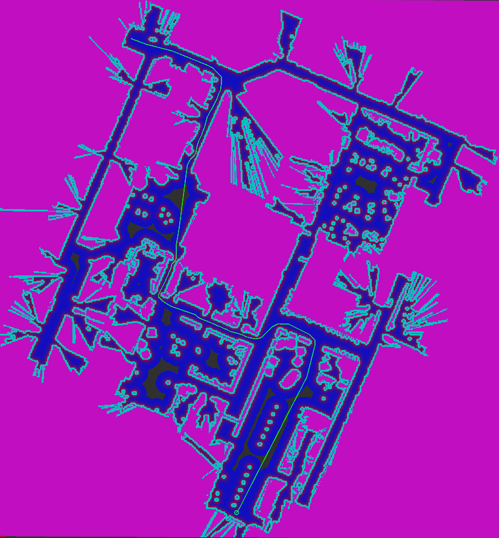

# Nav2 Theta Star Planner
The Theta Star Planner is a global planning plugin meant to be used with the Nav2 Planner Server. The `nav2_theta_star_planner` implements a highly optimized version of the Theta\* Planner (specifically the [Lazy Theta\* P variant](http://idm-lab.org/bib/abstracts/papers/aaai10b.pdf)) meant to plan any-angle paths using A\*. The planner supports differential-drive and omni-directional robots.

See its [Configuration Guide Page](https://navigation.ros.org/configuration/packages/configuring-thetastar.html) for additional parameter descriptions.

## Features
- The planner uses A\* search along with line of sight (LOS) checks to form any-angle paths thus avoiding zig-zag paths that may be present in the usual implementation of A\*
- As it also considers the costmap traversal cost during execution it tends to smoothen the paths automatically, thus mitigating the need to smoothen the path (The presence of sharp turns depends on the resolution of the map, and it decreases as the map resolution increases)
- Uses the costs from the costmap to penalise high cost regions
- Allows to control the path behavior to either be any angle directed or to be in the middle of the spaces
- Is well suited for smaller robots of the omni-directional and differential drive kind
- The algorithmic part of the planner has been segregated from the plugin part to allow for reusability

## Metrics
For the below example the planner took ~46ms (averaged value) to compute the path of 87.5m -


The parameters were set to - `w_euc_cost: 1.0`, `w_traversal_cost: 5.0` and the `global_costmap`'s `inflation_layer` parameters are set as - `cost_scaling_factor:5.0`, `inflation_radius: 5.5`

## Cost Function Details
### Symbols and their meanings
**g(a)** - cost function cost for the node 'a'

**h(a)** - heuristic function cost for the node 'a'

**f(a)** - total cost (g(a) + h(a)) for the node 'a'

**curr** - represents the node whose neighbours are being added to the list

**neigh** - one of the neighboring nodes of curr

**par** - parent node of curr

**euc_cost(a,b)** - euclidean distance between the node type 'a' and type 'b'

**costmap_cost(a,b)** - the costmap traversal cost (ranges from 0 - 252, 255 = unknown value) between the node type 'a' and type 'b'

### Cost function
```
g(neigh) = g(curr) + w_euc_cost*euc_cost(curr, neigh) + w_traversal_cost*(costmap_cost(curr,neigh)/LETHAL_COST)^2
h(neigh) = w_heuristic_cost * euc_cost(neigh, goal)
f(neigh) = g(neigh) + h(neigh)
```
Because of how the program works when the 'neigh' init_rclcpp is to be expanded, depending
on the result of the LOS check, (if the LOS check returns true) the value of g(neigh) might change to `g(par) +
w1*euc_cost(par, neigh) + w2*(costmap(par,neigh)/LETHAL_COST)^2`

## Parameters
The parameters of the planner are :
- ` .how_many_corners ` : to choose between 4-connected and 8-connected graph expansions, the accepted values are 4 and 8
- ` .w_euc_cost ` : weight applied on the length of the path.
- ` .w_traversal_cost ` : it tunes how harshly the nodes of high cost are penalised. From the above g(neigh) equation you can see that the cost-aware component of the cost function forms a parabolic curve, thus this parameter would, on increasing its value, make that curve steeper allowing for a greater differentiation (as the delta of costs would increase, when the graph becomes steep) among the nodes of different costs.
Below are the default values of the parameters :
```
planner_server:
  ros__parameters:
    planner_plugin_types: ["nav2_theta_star_planner/ThetaStarPlanner"]
    use_sim_time: True
    planner_plugin_ids: ["GridBased"]
    GridBased:
      how_many_corners: 8
      w_euc_cost: 1.0
      w_traversal_cost: 2.0
```

## Usage Notes

### Tuning the Parameters
Before starting off, do note that the costmap_cost(curr,neigh) component after being operated (ie before being multiplied to its parameter and being substituted in g(init_rclcpp)) varies from 0 to 1.

This planner uses the costs associated with each cell from the `global_costmap` as a measure of the point's proximity to the obstacles. Providing a gentle potential field that covers the entirety of the region (thus leading to only small pocket like regions of cost = 0) is recommended in order to achieve paths that pass through the middle of the spaces. A good starting point could be to set the `inflation_layer`'s parameters as - `cost_scaling_factor: 10.0`, `inflation_radius: 5.5` and then decrease the value of `cost_scaling_factor` to achieve the said potential field.

Providing a gentle potential field over the region allows the planner to exchange the increase in path lengths for a decrease in the accumulated traversal cost, thus leading to an increase in the distance from the obstacles. This around a corner allows for naturally smoothing the turns and removes the requirement for an external path smoother.

`w_heuristic_cost` is an internal setting that is not user changeable. It has been provided to have an admissible heuristic, restricting its value to the minimum of `w_euc_cost` and `1.0` to make sure the heuristic and travel costs are admissible and consistent.

To begin with, you can set the parameters to its default values and then try increasing the value of `w_traversal_cost` to achieve those middling paths, but this would adversely make the paths less taut. So it is recommended that you simultaneously tune the value of `w_euc_cost`. Increasing `w_euc_cost` increases the tautness of the path, which leads to more straight line like paths (any-angled paths). Do note that the query time from the planner would increase for higher values of `w_traversal_cost` as more nodes would have to be expanded to lower the cost of the path, to counteract this you may also try setting `w_euc_cost` to a higher value and check if it reduces the query time.

Also note that changes to `w_traversal_cost` might cause slow downs, in case the number of node expanisions increase thus tuning it along with `w_euc_cost` is the way to go to.

While tuning the planner's parameters you can also change the `inflation_layer`'s parameters (of the global costmap) to tune the behavior of the paths.

### Path Smoothing
Because of how the cost function works, the output path has a natural tendency to form smooth curves around corners, though the smoothness of the path depends on how wide the turn is, and the number of cells in that turn.

This planner is recommended to be used with local planners like DWB or TEB (or other any local planner / controllers that form a local trajectory to be traversed) as these take into account the abrupt turns which might arise due to the planner not being able to find a smoother turns owing to the aforementioned reasons.

While smoother paths can be achieved by increasing the costmap resolution (ie using a costmap of 1cm resolution rather than a 5cm one) it is not recommended to do so because it might increase the query times from the planner. Test the planners performance on the higher cm/px costmaps before making a switch to finer costmaps.

### When to use this planner?
This planner could be used in scenarios where planning speed matters over an extremely smooth path, which could anyways be handled by using a local planner/controller as mentioned above. Because of the any-angled nature of paths you can traverse environments diagonally (wherever it is allowed, eg: in a wide open region). Another use case would be when you have corridors that are misaligned in the map image, in such a case this planner would be able to give straight-line like paths as it considers line of sight and thus avoid giving jagged paths which arises with other planners because of the finite directions of motion they consider.


# Nav2 Theta Star 规划器（中文翻译）

## 概述
Theta Star 规划器是一个用于 Nav2 Planner Server 的全局规划插件。`nav2_theta_star_planner` 实现了高度优化的 Theta* 规划器（具体为 Lazy Theta* P 变体），用于生成任意角度路径（any-angle），避免常规 A* 的之字形路径。该规划器支持差分驱动与全向机器人。

参见配置指南：https://navigation.ros.org/configuration/packages/configuring-thetastar.html

## 特性
- 使用 A* 结合可视线（line of sight, LOS）检查生成任意角度路径，减少之字形路径。
- 在计算时考虑代价地图遍历代价，有利于自动使路径更平滑。
- 使用代价地图值惩罚高代价区域（更远离障碍）。
- 可控制路径行为：更偏向任意角方向或更居中于空间。
- 适合小型的全向或差分驱动机器人。
- 算法与插件部分分离，便于重用。

## 性能指标
示例中，规划器平均用时约 46ms（示例路径 87.5m）。示例参数：`w_euc_cost: 1.0`, `w_traversal_cost: 5.0`，以及代价地图膨胀层 `cost_scaling_factor:5.0`, `inflation_radius: 5.5`。

## 代价函数细节
符号说明：
- g(a)：节点 a 的已行成本
- h(a)：启发代价
- f(a)：总代价 f = g + h
- curr：当前正在扩展邻居的节点
- neigh：curr 的某个邻居节点
- par：curr 的父节点
- euc_cost(a,b)：a 与 b 的欧氏距离
- costmap_cost(a,b)：a 与 b 之间的代价地图遍历代价（范围 0–252，255 表示未知）

代价函数：
- g(neigh) = g(curr) + w_euc_cost * euc_cost(curr, neigh)
               + w_traversal_cost * (costmap_cost(curr,neigh)/LETHAL_COST)^2
- h(neigh) = w_heuristic_cost * euc_cost(neigh, goal)
- f(neigh) = g(neigh) + h(neigh)

若 LOS 检查通过，g(neigh) 可能改为基于 par 的计算：g(par) + w1*euc_cost(par, neigh) + w2*(costmap(par,neigh)/LETHAL_COST)^2。

## 参数说明（要点）
- `.how_many_corners`：决定 4 连通或 8 连通扩展（可取 4 或 8）。
- `.w_euc_cost`：路径长度项的权重（鼓励短路径）。
- `.w_traversal_cost`：对高代价节点的惩罚强度（值越大，越倾向避开高代价区域）。
示例默认：
```
planner_server:
  ros__parameters:
    planner_plugin_types: ["nav2_theta_star_planner/ThetaStarPlanner"]
    use_sim_time: True
    planner_plugin_ids: ["GridBased"]
    GridBased:
      how_many_corners: 8
      w_euc_cost: 1.0
      w_traversal_cost: 2.0
```

## 使用与调参建议
- costmap_cost(curr,neigh) 在计算前归一化为 0..1。
- 建议构建一个平缓的势场（gentle potential field），使大部分区域代价较低，仅在障碍附近有高代价，从而生成更居中的路径。可先设置膨胀层为 `cost_scaling_factor: 10.0`, `inflation_radius: 5.5`，然后根据需要降低 `cost_scaling_factor`。
- 增大 `w_traversal_cost` 会使路径更远离障碍，但可能使路径不够紧凑（更长）、增加扩展数从而变慢。可同时调大 `w_euc_cost` 以增加路径紧凑度并抵消查询时间增加。
- `w_heuristic_cost` 为内部设置，保持为 `min(w_euc_cost, 1.0)` 以确保启发与代价的一致性与可采性。
- 在调参时也可调整全局代价地图的 `inflation_layer` 参数以获得期望行为。

## 路径平滑
- 由于代价函数特性，输出路径自然会在拐角处趋于平滑，但平滑程度受转弯宽度与地图栅格数量影响。
- 建议配合局部规划器（如 DWB、TEB 或其他本地轨迹控制器）以处理可能的突变转角。
- 增加代价地图分辨率（更细的栅格）可提升平滑性，但会增加查询时间，需权衡。

## 适用场景
- 适合在追求规划速度且能由本地规划器处理小幅不平滑路径的场景使用。
- 任意角路径允许在开放空间进行对角穿越；在走廊错位或地图中轴线不对齐时表现良好。
- 若需非常平滑且对路径质量要求极高，可配合路径平滑器或更高分辨率代价地图。