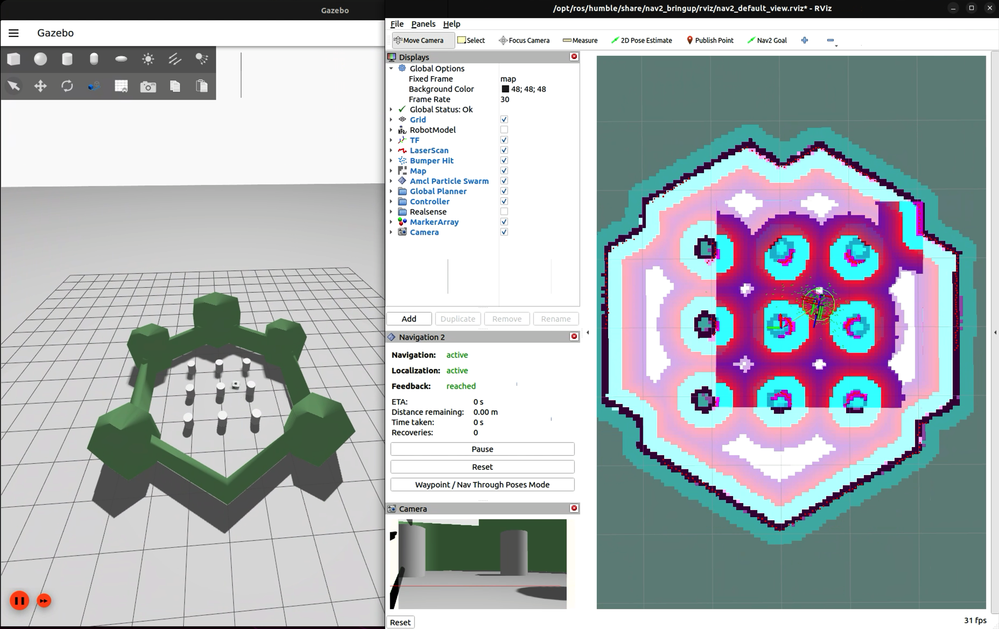

# navigation2_ignition_gazebo_turtlebot3
在 Ignition Gazebo 仿真器中使用 Nav2 导航仿真的 TurtleBot 3。

使用 `ROS_LOCALHOST_ONLY=1 TURTLEBOT3_MODEL=waffle ros2 launch turtlebot3 simulation.launch.py` 同时启动仿真、Nav2 和 RViz2。

`/odom` topic、`odom` frame 和 `/odom/tf`（tf topic）定义在 `model.sdf` 中。`base_footprint` 在 `odom` frame 下的变换通过 `/odom/tf` 发布。`/odom` topic 发布 `odom` frame 在 `map` frame 下的变换。

使用 `ros2 run tf2_tools view_frames` 查看 tf 坐标系关系。

Ignition Gazebo 发布 `joint_states`，随后通过 `ros_ign_bridge` 转换为 ROS 2 topic，并由 `robot_state_publisher`（一个 ROS 2 节点）消费，用于计算和发布大部分 tf。

`/odom/tf` 被重映射到 `/tf`。

Ignition Gazebo topic 通过 `ros_ign_bridge` 与 ROS 2 topic 相互转换。

调用 `nav2_bringup` 来初始化基础服务和配置。

已在 Ignition Gazebo Fortress 和 ROS 2 Humble 上测试。

依赖项：
  - `ros-<distro>-navigation2`
  - `ros-<distro>-nav2-bringup`
  - `ros-<distro>-ros-ign-gazebo`
  - `ros-<distro>-ros-ign-bridge`
